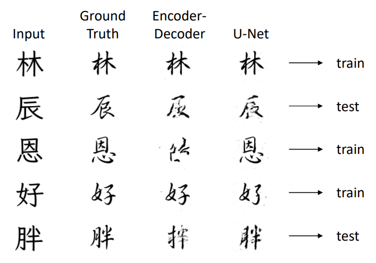
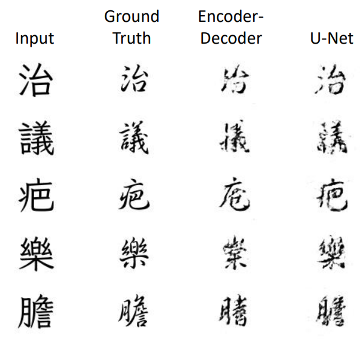

# Chinese Font Style Transfer
Course: Introduction to Artificial Intelligence, 2024 Spring  
Group Members: Thomas Yu, Sean Lin, Howgin

Applying pix2pix, a conditional GAN with generator either VAE or U-Net structures, to perform Chinese character styles transfer. Collecting dataset (training/testing) from existing `.ttf` in `data`.

## Demo
- A simple demo:

- On testing dataset:

## Reference
- P. Isola, J.-Y. Zhu, T. Zhou, and A. A. Efros. [Image-to-Image Translation with Conditional Adversarial Network](https://arxiv.org/abs/1611.07004). CVPR 2017.